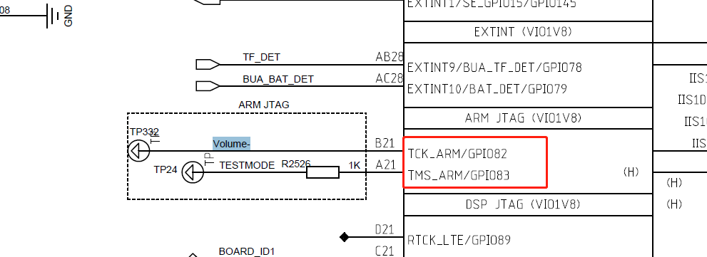

# 概要

项目要上单板测试模式

# 硬件

开机检测音量键还有testmode 同时拉低,进入测试模式



# 功能添加

其他部门做过这个平台,android 12 展锐8581e,可以针对性参考一下

* idh.code/bsp/bootloader/u-boot15/board/spreadtrum/uis8581e_5h10/uis8581e_5h10.c

添加开机检测函数`get_mode_from_pax_porting`

```
    CBOOT_FUNC s_boot_func_array[CHECK_BOOTMODE_FUN_NUM] = { 
        /* 0 get fastboot mode from keypad*/
        get_fastboot_mode_from_keypad_early,
        /* 1 get mode from bat low*/
        get_mode_from_bat_low,
        /* 2 get mode from sysdump*/
        write_sysdump_before_boot_extend,
        /* 3 get mode from miscdata flag*/
        get_mode_from_miscdata_boot_flag,
        /* 4 get mode from keypad*/
        get_mode_from_keypad_early,
        /* 5 get mode from pax porting*/
        get_mode_from_pax_porting,
        /* 6 get mode from file*/
        get_mode_from_file_extend,
        /* 7 get mode from watch dog*/
        get_mode_from_watchdog,
        /* 8 get mode from alarm register*/
        get_mode_from_alarm_register,
        /* 9 get mode from calibration detect*/
        get_mode_from_pctool,
        /* 10 get mode from charger*/
        get_mode_from_charger,
        /* 11 get mode from gpio*/
        get_mode_from_gpio_extend,
        /* 12 get mode from keypad*/
        get_mode_from_keypad,

        0
    };
```

* idh.code/bsp/bootloader/u-boot15/pax/devices/board_test/board_test_af6.c

```
unsigned int mode_chk_af6(void)
{
    int ret = 0;
    int io_num_a = 82, io_num_b = 83, io_num_a_level = 0, io_num_b_level = 0;

    sprd_gpio_request(NULL, io_num_a);
    sprd_gpio_direction_input(NULL, io_num_a);
    io_num_a_level = sprd_gpio_get(NULL, io_num_a);

    sprd_gpio_request(NULL, io_num_b);
    sprd_gpio_direction_input(NULL, io_num_b);
    io_num_b_level = sprd_gpio_get(NULL, io_num_b);
	
    if (io_num_a_level == 0 && io_num_b_level == 0) {
        ret = 1;
    }

    printf("hbc:%d-%s:ret = %d, io_num_a_level = %d, io_num_b_level = %d.\n", __LINE__, __func__, ret, io_num_a_level, io_num_b_level);

    return ret;
}
```

* idh.code/bsp/bootloader/u-boot15/pax/devices/pax_device_af6.c

```
pax_board_test_ops board_test_ops_af6= {
    .test_mode_chk = mode_chk_af6,
    .ap_board_test = ap_test_af6,
    .turnon_testpower = turnon_power_af6,
    .turnoff_testpower = turnoff_power_af6,
	.ignore_bat_low_check = ignore_bat_low_check_af6,
};
```

* idh.code/bsp/bootloader/u-boot15/pax/porting.c

检测硬件是否同时拉低`test_mode_chk`,进入测试模式

```
boot_mode_enum_type get_mode_from_pax_porting(void)
{
	unsigned int ret = 0;
	board_test_ops = pax_get_board_test_ops();

	if (board_test_ops->test_mode_chk()) {
		if (base_info_t->need_factorytest == 1) {
			return CMD_FACTORYTEST_MODE;
		} else {
			lcd_center_printf(30,"PAX TEST MODE\n");
			ret = board_test();
			debugf("board_test() ret=%#x\n", ret);
		}
	}

	return CMD_UNDEFINED_MODE;
}
```

* idh.code/bsp/bootloader/u-boot15/pax/board_test.c

单板测试测一些基本功能,例如charger,fgu的ic id,还有sp 的exsn

`boardtest_uart_channel` 在具体项目配置为1

`puts`是发送到调试控制台`idh.code/bsp/bootloader/u-boot15/common/console.c`

`board_test`进入while 1 循环,需要控制台输入`S`

```
void pax_puts(int channel,const char *str)
{
    if(channel == 1)
		puts(str);
	else
	{
       sprd_serial_init_uart2(115200);
	   udelay(50);
	   uart2_puts(str);
	   
	}
   
}
extern unsigned int board_test(void)
{
    char ch = 0;
    char buffer[128] = {0};
    char exsn[64] = {0};
    unsigned int ret = 0x00;
    unsigned int exsn_ret = 0x00;
    unsigned int ret_temp = 0x00;
    unsigned int result = 0x00;
    unsigned int length = 0;

	testMD_flag  =1;
    pax_puts(base_info_t->boardtest_uart_channel,"TESTMODE:IN"); 
  

retest:

	while(1) {
        ch = pax_getc(base_info_t->boardtest_uart_channel);
        if(ch == 'S') {
            break;
        }
    }
    ret = 0x00;
    ret_temp = 0x00;
    result = 0x00;
    length = 0;

    board_test_ops->turnon_testpower();

    set_phase_check_sation(1,4,1); //tested

    ret = board_test_ops->ap_board_test(); 

    //SP board test
    if(base_info_t ->need_test_sp == 1)
	{
        pax_porting_init();
		result = pax_sp_do_board_test();
	    if(result){
	        ret |= result<<16;
	    }
    }
	
    memset(exsn,0,sizeof(exsn));
    exsn_ret = pax_get_exsn(exsn,sizeof(exsn));
    if(exsn_ret!=0){
      exsn[0]=0;
    }else{
      if(exsn[0]==0xff)
        exsn[0]=0;
    }
    exsn[63]=0;

    if(!strlen(exsn)){
      strcpy(exsn,"null");
    }

    if(!ret){
        length += sprintf(buffer, "TESTMODE:OK,EXSN:");
        length += sprintf(&buffer[length], "%s", exsn);
        buffer[length] = '\0';
        pax_puts(base_info_t->boardtest_uart_channel,buffer);
        set_phase_check_sation(0,4,1); //pass
    }else{
        set_phase_check_sation(0,4,0); //nopass
        length += sprintf(buffer, "TESTMODE:ERR:");
        ret_temp = ret;
        for(ch = 0; ch < sizeof(ret) * 8; ++ch){
            if(ret_temp & 0x01)
                length += sprintf(&buffer[length], "%d,", (int)ch+1);
            ret_temp = ret_temp >> 1;
        }
		length += sprintf(&buffer[length], "EXSN:");
        length += sprintf(&buffer[length], "%s", exsn);
        buffer[length] = '\0';
        pax_puts(base_info_t->boardtest_uart_channel,buffer);
    }
    
goto retest;

    return ret;
}
```