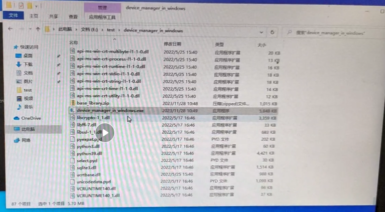
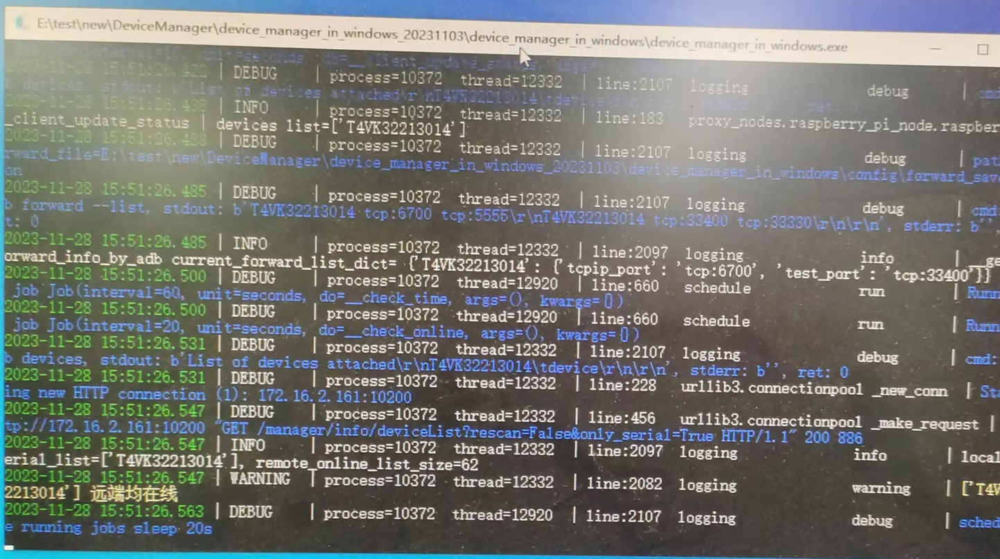
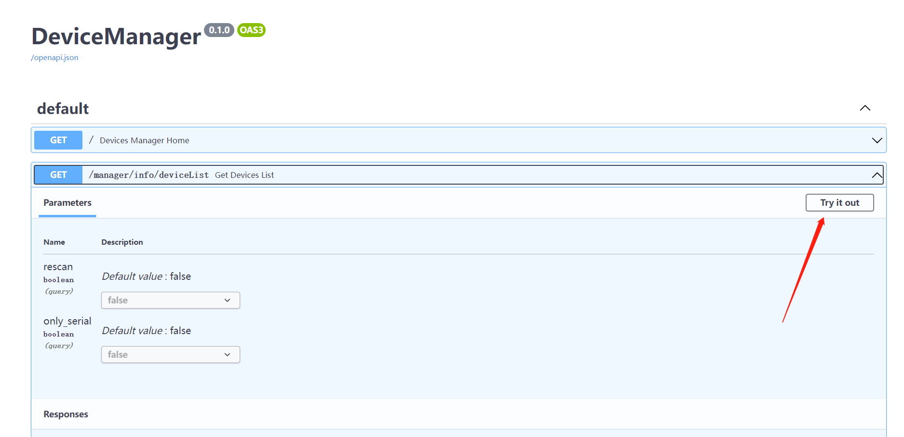
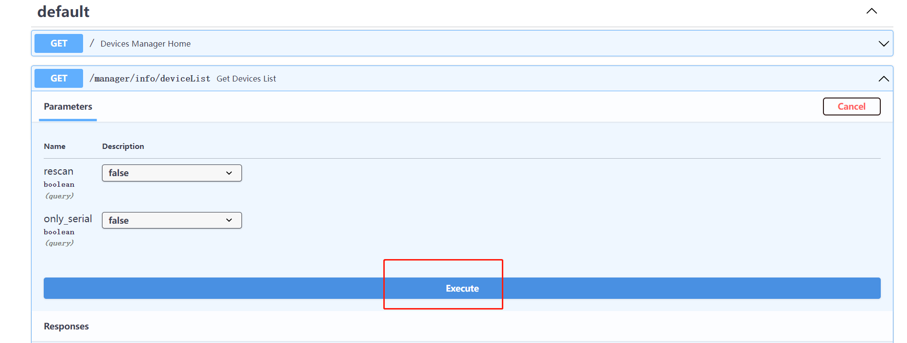
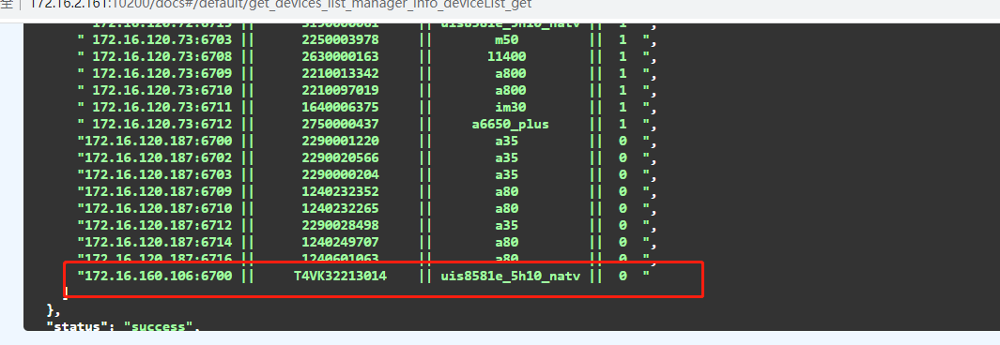
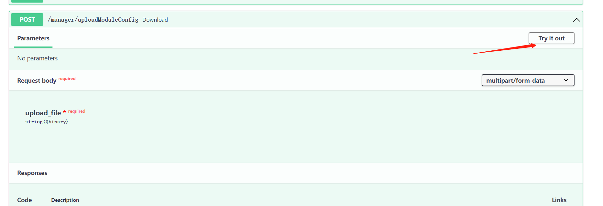
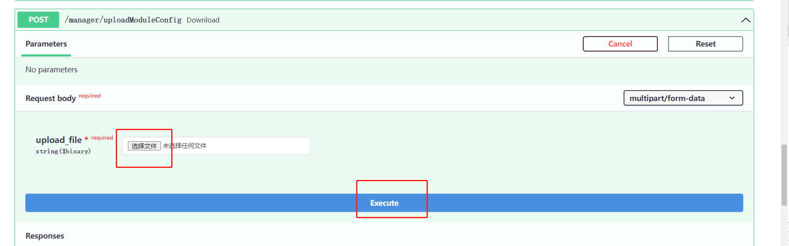
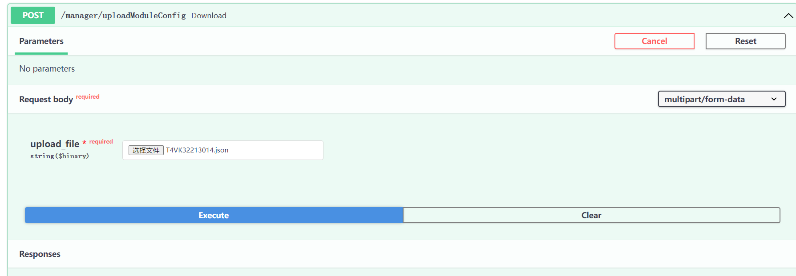

# 概要

提测之前,都要求自测试报告

# 测试电脑

* DeviceManager

使用管理者权限,运行device_manager_in_windows.exe

需要注意运行device_manager_in_windows版本,可能有些版本运行不了.

正确运行后,命令行窗口要提示设备在线





# 后台

http://172.16.2.161:10200/docs#/default/get_devices_list_manager_info_deviceList_get

* 查看设备在线

点击try it out,然后点击execute, 显示设备的sn号,在线







* 上传设备的测试模块jason文件

点击try it out,上传jason文件,点击execute







* jason文件样板,T4VK32213014.json

```
{
"PED_S": false,
"PED_AES": false,
"AdvanceSystem": false,
"MiscSettings": false,
"ALGORITHM": true,
"BASIC": false,
"CardType": ["Felica"]
}
```

# jenkins配置执行任务

* http://172.16.2.161:8080/

    账号:paxdev,密码paxdev123

* 已有项目配置,Develop_MiscSettings_test

配置内容

```
pipeline {
    agent {
        node {
            label 'master'
            customWorkspace "/sdb1/jenkins/workspace/${env.JOB_NAME}"
        }
    }


    stages {
        stage('git pull') {
            steps {
                echo 'git pull'
                git credentialsId: 'pw_lh', url: 'http://172.16.2.83/testtools/PaxTestByPytest.git'
            }
        }
        stage('build env') {
            steps {
                echo 'build env'
                sh 'ls'
                echo 'current dir0=' + pwd()
                sh 'python3 -m pip install -r requirements.txt'
            }
        }

        stage('android test') {
            steps {
                // --suites ALGORITHM
                echo 'android test'
                sh """python3 -m pytest ./tests/pax/mutil/test_run_by_paydroidtester.py::test_android_case_by_devices --task_name ${JOB_NAME} --task_run_num ${BUILD_NUMBER} --serial T4VK32213014 --install_apk_dir ${signTestApkDir} --user libin --devkey f12e5613b580128ffa26ae7d71e476bd --project_name  Android软件测试-2023 --wait_device_min 5 --module "ALGORITHM" --email_cc "xielianxiong@paxsz.com" """
            }
        }
    }

    post {
        always {
            echo 'One way or another, I have finished'
            sh """python3 ./ci/deal_task.py ${JOB_NAME} ${BUILD_NUMBER}"""
        }
        success {
            echo 'I succeeeded!'
        }
        unstable {
            echo 'I am unstable :/'
        }
        failure {
            echo 'I failed :('
        }
        changed {
            echo 'Things were different before...'
        }
    }
}
```

# 使用方法

* jason文件配置要测试的模块,改成true

* jenkins 配置,修改sn号,跟测试的模块名称

    `--serial T4VK32213014`

    `--module "ALGORITHM"`

* 配置通知邮箱

    `--email_cc "xielianxiong@paxsz.com"`