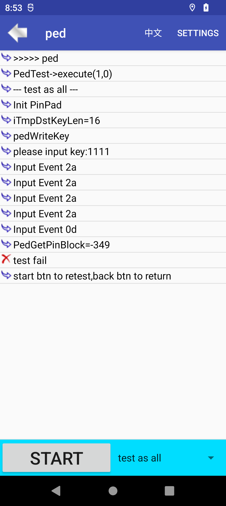
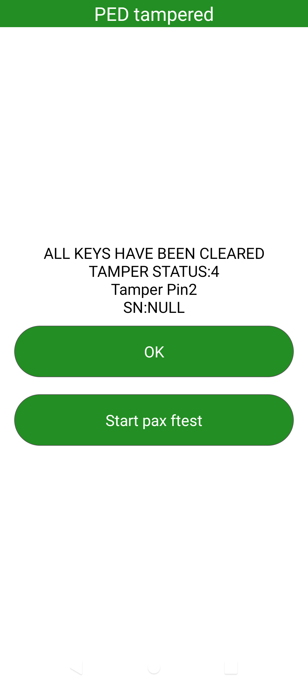

# 时间

# 问题描述
L0 状态下,机器开机,提示全部触发提示,点击OK,进入ftest,测试ped失败

# 分析
* 对现象做初步分析
    > 机器在单板下载后,机器开机了,提示全部触发.
    > 关机,或者掉电, 装成整机,整机的硬件触发没有问题.
    > 开机,提示全部触发界面,点击OK,进入ftest,测试ped,提示失败
    > 图片捉到的话,补两张

* 打开日志开关,setprop pax.ctrl.log 1, 放到abl,烧录进去,默认打开
    > 然后搜索PAXCLI,Ped_Fun,这些都是ped接口的tag

* 跟ped同事沟通,认为是没有格式化ped引起,大家都提供不了准确的答案,只能自己捉log分析
    * 先捉一个ped正常的log
    * 打开一个触发点点,提示触发,如下图.
    
    * 点击OK,进入ftest ped,结果如下
    
    * 硬件整好触发点,重启,提示触发历史界面
    
    * 点击OK,测试ftest ped
    
    * log提示 -349,sp,返回P_ERR_PED_DATA_CRC_ERR,代表sp 没有格式化ped,
    * 看开机流程,有格式化ped的初始化,看看加一些log,看看是否初始化条件没有满足
    > spdev.c-> SpdevOpen -> Spdev_FormatPed(1),先把条件注释,开机强制格式化ped,看看是否OK
    ```
    int Spdev_FormatPed(int iPedState)
    {
        int iRet;
        ALOGE("victor,Spdev_FormatPed:iPedState = %d,\r",iPedState);
        /*
        if (iPedState == 1)
        {
            //SEK为空，则格式化ped, 触发不格式ped
            int sek = SPC_isSekClear();
            int tamper = s_GetTamperStatus();
            ALOGE("sek = %d,tamper == %d,\r",sek,tamper);
            if (!sek || tamper == 1)
            {
                ALOGE("!!!!!lanxq=not SPC_isSekClear:\r");
                return 0;
            }		
        }
        */
        iRet = SPC_XosPedEraseKeys(XOS_PED_FORMAT_PED, 0);
        return PEDRet(iRet);
    }
    ```
    > 强制格式化后,问题不存在,加log发现是s_GetTamperStatus 返回值的问题,第一次返回0 ,再重启,一次,返回1

* 分析s_GetTamperStatus,该值就是从authinfo_sp.c->authinfo.pos_auth_info.LastBblStatus
    > authinfo_sp.c 添加log,捉取开机log
    > 发现问题的原因,就是没有用sp实时传过来的LastBblStatus,而是或上了命令行的LastBblStatus
    > sp触发,关机,修好,开机,sp把第一次历史记录传过来,开启后,sp又把没有触发的信息传过来,但是我们一直或上了一开始命令行的值,所以导致开机的时候,没有去格式化sp
    ```authinfo.pos_auth_info.LastBblStatus=(val->intval | authinfo.pos_auth_info.LastBblStatus);```

# 解决

在L0 状态下,直接使用sp传过来的实时值,不显示历史记录界面也没所谓
```
+++ b/UM.9.15/kernel/msm-4.19/drivers/misc/pax/auth_info_sp/authinfo_sp.c
@@ -474,7 +474,11 @@ static int authinfo_set_property(enum authinfo_supply_property asp,
                        authinfo.pos_auth_info.TamperClear=val->intval;
                        break;
                case AUTHINFO_SUPPLY_PROP_LASTBBLSTATUS:
-                       authinfo.pos_auth_info.LastBblStatus=(val->intval | authinfo.pos_auth_info.LastBblStatus);
+            if(authinfo.pos_auth_info.SecMode == POS_SEC_L0){
+                authinfo.pos_auth_info.LastBblStatus = val->intval;
+            }else{
+                authinfo.pos_auth_info.LastBblStatus=(val->intval | authinfo.pos_auth_info.LastBblStatus);
+            }
                        break;
```

# 总结

sp 触发状态与否,与LastBblStatus 息息相关,后续遇到触问题的时候,可以先向这个值入手