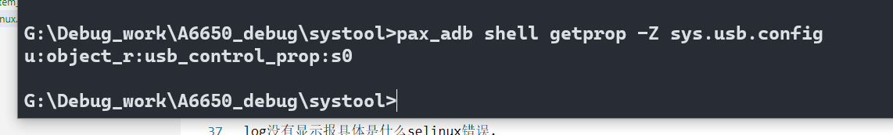

# systool 设置sys.usb.config失败

因为要做一个功能,自动化轮询设备的插入,有设备插入就通过systool 配置sys.usb.config=diag,serial_cdev,rmnet,adb

切换出高通默认端口,达到工厂生产顺利耦合测试

# log

```
04-11 02:42:48.315 I/adbd    ( 1250): type=1400 audit(0.0:1170): avc: denied { write } for path="socket:[22104]" dev="sockfs" ino=22104 scontext=u:r:su:s0 tcontext=u:r:adbd:s0 tclass=unix_dgram_socket permissive=1
04-11 02:42:48.320 W/ADB_SERVICES( 1250): daemon_service_to_fd cmd_name:shell:systool set sys.usb.config diag,serial_cdev,rmnet,adb
04-11 02:42:48.347 I/sh      ( 6615): type=1400 audit(0.0:1171): avc: denied { getattr } for path="/system/bin/systool" dev="dm-4" ino=647 scontext=u:r:su:s0 tcontext=u:object_r:system_file:s0 tclass=file permissive=1
04-11 02:42:48.347 I/sh      ( 6615): type=1400 audit(0.0:1172): avc: denied { execute } for name="systool" dev="dm-4" ino=647 scontext=u:r:su:s0 tcontext=u:object_r:system_file:s0 tclass=file permissive=1
04-11 02:42:48.353 W/audit   (    0): audit_lost=490 audit_rate_limit=5 audit_backlog_limit=1024
04-11 02:42:48.353 E/audit   (    0): rate limit exceeded
04-11 02:42:48.347 I/sh      ( 6615): type=1400 audit(0.0:1173): avc: denied { read open } for path="/system/bin/systool" dev="dm-4" ino=647 scontext=u:r:su:s0 tcontext=u:object_r:system_file:s0 tclass=file permissive=1
04-11 02:42:48.347 I/sh      ( 6615): type=1400 audit(0.0:1174): avc: denied { execute_no_trans } for path="/system/bin/systool" dev="dm-4" ino=647 scontext=u:r:su:s0 tcontext=u:object_r:system_file:s0 tclass=file permissive=1
04-11 02:42:48.392 E/linker  ( 6615): "/system/lib64/libpaxspdev.so": ignoring DT_PREINIT_ARRAY in shared library!
04-11 02:42:48.393 W/DLOG    ( 6615): [2023-04-11 02:42:48].000 S/ systool(06615): argv[0]=systool
04-11 02:42:48.394 W/DLOG    ( 6615): [2023-04-11 02:42:48].000 S/ systool(06615): argv[1]=set
04-11 02:42:48.394 W/DLOG    ( 6615): [2023-04-11 02:42:48].000 S/ systool(06615): argv[2]=sys.usb.config
04-11 02:42:48.394 W/DLOG    ( 6615): [2023-04-11 02:42:48].000 S/ systool(06615): argv[3]=diag,serial_cdev,rmnet,adb
04-11 02:42:48.394 D/ProcessState( 6615): Binder ioctl to enable oneway spam detection failed: Invalid argument
04-11 02:42:48.396 D/systool_server( 1083): FUNC(svr_systoolGetPermissions)
04-11 02:42:48.394 I/binder  (    0): 6615:6615 ioctl 40046210 7fd43a23e4 returned -22
04-11 02:42:48.396 D/systool_server( 1083): systoolGetPermissions = 0
04-11 02:42:48.397 D/DLOG    ( 6615): isSystoolCmdGranted(): auth=0, FirmDebug=1, SecMode=1
04-11 02:42:48.397 D/systool_server( 1083): FUNC(svr_systoolExecShellCmd)
04-11 02:42:48.397 W/DLOG    ( 1083): pid = 6615 , process name = systool
04-11 02:42:48.425 W/libc    ( 6617): Unable to set property "sys.usb.config" to "diag,serial_cdev,rmnet,adb": error code: 0x18
04-11 02:42:48.426 W/DLOG    ( 1083): serverExecShellCmd setprop sys.usb.config diag,serial_cdev,rmnet,adb failed 
04-11 02:42:48.425 E/init    (    0): Unable to set property 'sys.usb.config' from uid:0 gid:0 pid:6617: SELinux permission check failed
```

# 分析

log没有显示报具体是什么selinux错误.

所以通过命令,adb shell getprop -Z sys.usb.config,看看输出,该属性是哪个数组,然后通过配置systool的te文件,添加相应属性



# 解决

* systoold.te 加上 usb_control_prop的访问

```
xielx@u295:~/ssdCode/a6650_1$ git diff QSSI.12/vendor/paxsz/sepolicy/public/systoold.te
diff --git a/QSSI.12/vendor/paxsz/sepolicy/public/systoold.te b/QSSI.12/vendor/paxsz/sepolicy/public/systoold.te
index d7bd75932fd..6dee7d3c388 100755
--- a/QSSI.12/vendor/paxsz/sepolicy/public/systoold.te
+++ b/QSSI.12/vendor/paxsz/sepolicy/public/systoold.te
@@ -85,3 +85,4 @@ allow systoold pax_nvram_device:blk_file { read write open };
 allow systoold { mnt_user_file fuse }:dir { search };
 allow systoold fuse:file { read open getattr };
 #[FEATURE]-Add-end by xielianxiong@paxsz.com, 2022/02/11, for posapi setBootAnimation_FUN1
+allow systoold usb_control_prop:property_service { set };
```