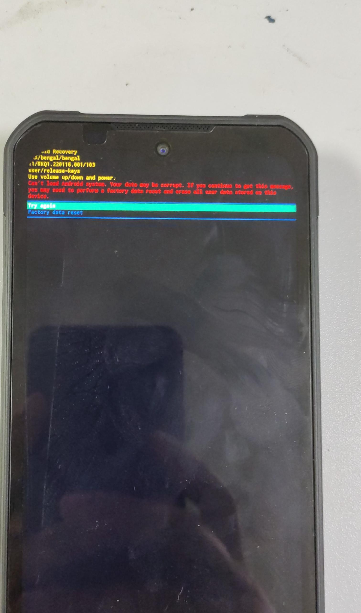
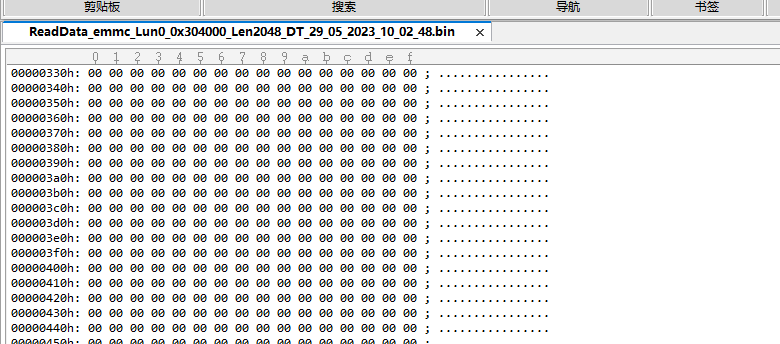
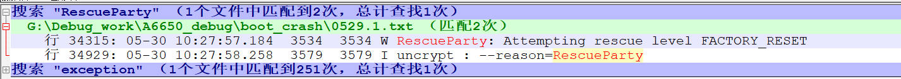
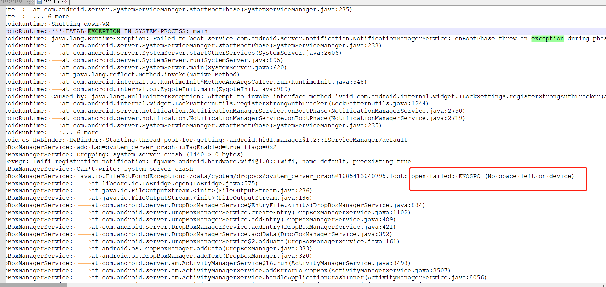

# 长时间录制视频

楼下2台机器,测试录制视频,两台都显示进入recovery

# 分析

由于是user版本,并且recovery模式下,没有打开adb,所以先dump misc分区出来,看看能不能看到什么原因

# dump misc

* 按 try again,让机器重启,然后同时按住音量上下键,机器进入9008 模式

    

* dump misc分区出来 啥都没有

    

# 直接fastboot erase misc

可能是工具读取misc分区有问题,采用直接erase misc分区的方法,让系统起来

* fastboot erase misc

* fastboot reboot

* adb wait-for-device && adb logcat > 0529.1.txt

    * 如果没有adb权限的话,要下载一个带debug态的sp

* adb pull /data/system/dropbox

    * 如果上面这一步就可以看到明显信息的话,dropbox就可以不需要了

# 这一题捉出来的log 0529.1.txt

* 直接原因可以看到,RescueParty 升级到 FACTORY_RESET

    

* 在搜索 exception,可以看到system server因为 没有空间挂了

    

# 解决方法

* sdcard 文件系统 预留100M 禁止写满

* QSSI.12/system/core/sdcard/sdcard.cpp

```
static bool sdcardfs_setup(const std::string& source_path, const std::string& dest_path,
                           uid_t fsuid, gid_t fsgid, bool multi_user, userid_t userid, gid_t gid,
                           mode_t mask, bool derive_gid, bool default_normal, bool unshared_obb,
                           bool use_esdfs) {
    // Add new options at the end of the vector.
    std::vector<std::string> new_opts_list;
    if (multi_user) new_opts_list.push_back("multiuser,");
    if (derive_gid) new_opts_list.push_back("derive_gid,");
    if (default_normal) new_opts_list.push_back("default_normal,");
    if (unshared_obb) new_opts_list.push_back("unshared_obb,");
    // Try several attempts, each time with one less option, to gracefully
    // handle older kernels that aren't updated yet.
    for (int i = 0; i <= new_opts_list.size(); ++i) {
        std::string new_opts;
        for (int j = 0; j < new_opts_list.size() - i; ++j) {
            new_opts += new_opts_list[j];
        }

        auto opts = android::base::StringPrintf("fsuid=%d,fsgid=%d,%smask=%d,userid=%d,gid=%d",
                                                fsuid, fsgid, new_opts.c_str(), mask, userid, gid);
        if (mount(source_path.c_str(), dest_path.c_str(), use_esdfs ? "esdfs" : "sdcardfs",
                  MS_NOSUID | MS_NODEV | MS_NOEXEC | MS_NOATIME, opts.c_str()) == -1) {
            PLOG(WARNING) << "Failed to mount sdcardfs with options " << opts;
        } else {
            return true;
        }
    }

    return false;
}
```