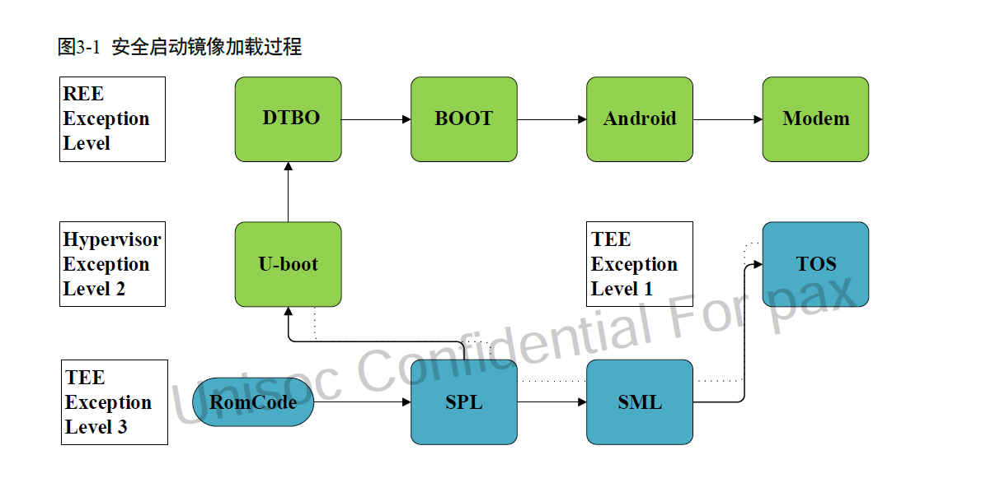
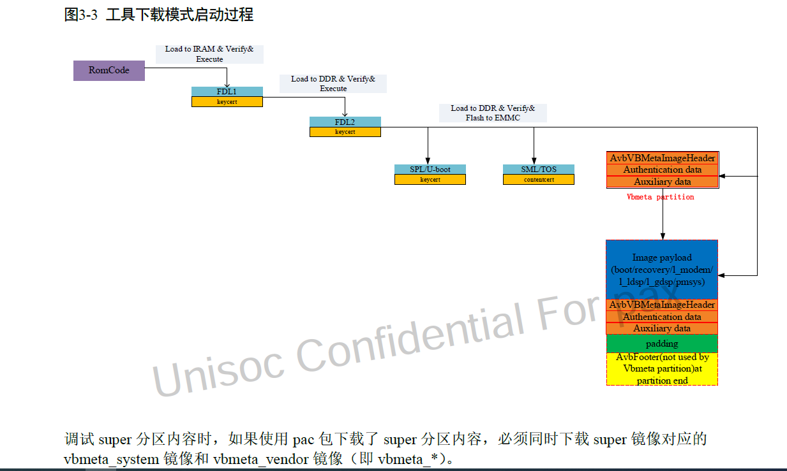

# 概要

展锐平台安全启动流程,了解启动流程,对整个系统有很大的帮助

# 关键字

安全启动

# 正常启动流程图

从romcode开始,启动时运行安全模式,逐级加载,并校验安全镜像,再引导系统到内核

* cpu会再ROTPK efuse区域,烧录公钥的哈希值

* 上电后,加载spl,cong spl分区读出公钥,并于roptk记录的公钥哈希值比较,一致才通过

* spl,Second Program Bootlader,运行在Secure 的IRAM,初始化DRAM,加载SML(Arm Trusted firmware),TOS(Trusty OS,TEE),和u-boot到DRAM,

并且校验这三个镜像的合法性,验证通过,执行SML

* SML 运行TOS,TOS运行内置的TA,然后TOS返回SML,SML返回u-boot

* u-boot运行在Hypervisor 模式,负责检查设备的状态,加载并且校验dtbo,boot,recovery等镜像,引导内核

* kernel 负责验证Android系统的分区,验证通过后,将其挂在为只读系统分区

* android启动后,modem_control服务负责校验和加载modem子系统的固件

# 下载固件流程

fdl1.bin镜像与spl镜像作用相同,要验签,fdl1 初始化DRAM并加载和校验fdl2.bin

fdl2 负责与PC交互,接收和检验pc端下发的数据

# 返回滚

使用防篡改的存储空间类记录最新的版本,flash的rpmb

在安全下载及启动过程中，系统将当前镜像版本号与存储在efuse（trusty firmware）和rpmb 分区的版本号进行比较。

当前镜像版本号大于等于efuse 和rpmb 分区版本号才允许系统启动，在系统完全启动后，

如果是新的版本号，则更新到一次性可写区域。

* ab分区

rpmb 空间划分为a/b 两块区域储存版本号，rpmb 储存的版本号在第一次开机升级对应区域（a/b）的版本号

* 未使用v-ab 分区方案时

第一次开机就升级版本号

* rpmb分区

RPMB（Replay Protected Memory Block）Partition 是 eMMC 中的一个具有安全特性的分区。
eMMC 在写入数据到 RPMB 时，会校验数据的合法性，只有指定的 Host 才能够写入，同时在读数据时，也提供了签名机制，保证 Host 读取到的数据是 RPMB 内部数据，而不是攻击者伪造的数据。

