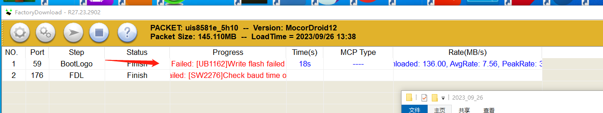
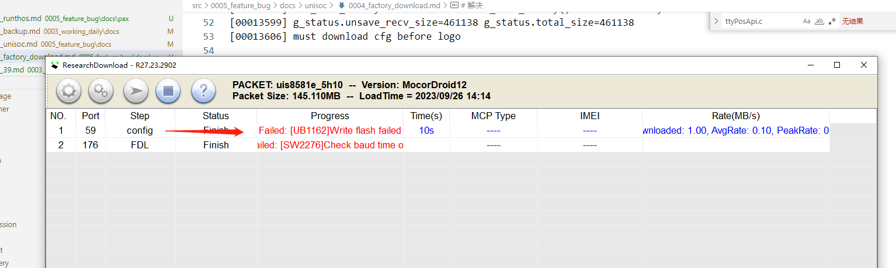

# 概要

展锐平台,裸板下载,本来按照原生流程下载pac包即可,但是公司做了一些定制化

所以需要定制化下载

# 二部

按照其他部门做过这个平台,先参考其他平台的下载流程

* sp cid

* sp boot

* pac (配置文件也打包在里面)

* 刷modem (即cpv)

* paydroid

# 问题1

原来可以开机的机器,格式化编译出来的软件后,下载报错,must download cfg before logo



# log

* D:\Download_R27.23.2902\Bin\Log\2023_09_26\FAIL(262)_SN10808629492616_COM59-2023_09_26-13_43_31_511\UbootDump.txt

```
[00012971] avb_slot_verify.c:1418: DEBUG: avb_slot_verify() out_data is NULL
[00012977] avb_slot_verify.c:1454: DEBUG: avb_slot_verify() alloc slot_data success!
[00012985] avb_slot_verify.c:1478: DEBUG: avb_slot_verify() start load and verify vbmeta image
[00012993] avb_slot_verify.c:693: DEBUG: Loading vbmeta struct from partition 'vbmeta_a'.
[00013010] uboot_avb_ops.c:200: DEBUG: Enter: implement validate_vbmeta_public_key().
[00013018] uboot_avb_ops.c:236: DEBUG: expected_public_key is matched.
[00013030]  read write count:0x7 ,msg_type:0x400
[00013036] sprd_get_imgversion: rpmb read blk 16382 fail! ret 1 
[00013042] hbc:magic = AVB0, partition_name = vbmeta, rollback_index = 1.
[00013049] avb_slot_verify.c:688: DEBUG: Loading vbmeta struct in footer from partition 'dtbo_a'.
[00013065]  read write count:0x7 ,msg_type:0x400
[00013071] sprd_get_imgversion: rpmb read blk 16382 fail! ret 1 
[00013077] hbc:magic = AVB0, partition_name = dtbo, rollback_index = 1.
[00013084] avb_slot_verify.c:1252: DEBUG: load_and_verify_vbmeta() process success.
[00013091] avb_slot_verify.c:1255: DEBUG: load_and_verify_vbmeta() goto out.
[00013098] avb_slot_verify.c:1252: DEBUG: load_and_verify_vbmeta() process success.
[00013105] avb_slot_verify.c:1255: DEBUG: load_and_verify_vbmeta() goto out.
[00013112] avb_slot_verify.c:1598: DEBUG: avb_slot_verify() save slot_data to *out_data 
[00013120] avb_slot_verify.c:1612: DEBUG: avb_slot_verify() %^*&&*(* not alllow verification error
[00013128] avb_slot_verify.c:1616: DEBUG: avb_slot_verify() avb slot verify OK!
[00013599] g_status.unsave_recv_size=461138 g_status.total_size=461138 
[00013606] must download cfg before logo

[00013609] Error!dload_whole_raw_file(): Download write err!!!, stop!!!
```

# 解决

问题一,因为代码有限制必须下载了配置文件,才能下载logo

* idh.code/bsp/bootloader/u-boot15/pax/pax.c

```
int pax_download_handle(int type, const char *name, void *data, unsigned long long *lsz)
{
	char tmp_buf[4096];
	unsigned long width, height, bmp_width, fb_width;
	struct bmp_image *bmp;
	unsigned long long sz = *lsz;

	printf("==%s, name: %s\n", __func__, name);

	memset(tmp_buf,0,4096);

	if(pax_porting_cfg_check(name))//here
	{
		printf("must download cfg before %s\r\n",name);
		return -1;
	}
```

# 问题二

为了问题1,添加cfg下载,但是cfg又下载失败



# log

```
[00001109] Hit any key to stop autoboot:  0 ANDROID: Booting slot_a
[00001117] Watch Dog Trace: WDG_TimerStop
[00001121] do_download: loader 1 auto 0
[00001124] do_download:enter
[00001260] now time sec 0
[00001263] now alarm sec 0
[00001270] Find gpt header from user partition,emmc was used
[00001282] is_wr_mmc_rpmb_key rpmb key not write
[00001290] Error!dl_cmd_get_timestamp(): read timestamp magic(0) incorrect.
[00001297] dl_cmd_handler:enter
[00005520] g_status.unsave_recv_size=616 g_status.total_size=616 
[00005526] ==pax_download_handle, name: config
[00005530] cfg len 616
[00005532] cfg2 len 615
[00005540] cfg3 len 615
[00005546] permanent_config_get: i=0, key=TERMINAL_NAME, value=A930RTX
[00005552] hbc:925-pax_check_cfg_product:pmt_ret = 7, produce_buf = A930RTX, produce_cfg_buf = AF6.
[00005561] pax_check_cfg_product error
[00005566] Error!dload_whole_raw_file(): Download write err!!!, stop!!!
```

# 原因

* 没有勾选格式化问题,检测到原有分区的型号名是A930RTX,不准下配置为AF6的配置文件

# 问题三

pax1 分区,显示total size = 0,

# log

```
[00000387] record not found========================[cfg_partition_set 322] key:mmc_erase_content value length:1
[00000403] [cfg_partition_set 330] i:-1
[00000406] [cfg_partition_set 332] partition contain none records
[00000412] ========================[cfg_partition_get mmc_erase_content]
[00000418] record not found[cfg_partition_set 411] lrc:0x49
[00000423] ========================[cfg_partition_write 226]
[00000429] cfg_partition_write partition offset 0(real offset:0) length:24
[00000435] Error!common_raw_write(): write size(0x18 + 0x0) overflow the total partition size(0x0)
[00000444] error writing records(mmc_write fail)
[00000448] Error!common_raw_write(): write size(0x18 + 0x0) overflow the total partition size(0x0)
[00000457] error writing records(mmc_write fail)
[00000461] Error!common_raw_write(): write size(0x18 + 0x0) overflow the total partition size(0x0)
[00000470] error writing records(mmc_write fail)
[00000474] cfg_partition_write error
[00000478] Error!common_raw_read(): read size(0x1000 + 0x0) overflow the total partition size(0x0)
[00000486] pax_cfg_init:find signflag fail
[00000490] pax_cfg_init error!
```

# 原因

展锐工具问题,使用最新的R27工具有问题.使用R25.21.1401 rearch downloader 没有问题

# 问题四

格式化机器后,开机到动画界面,自动重启

# 原因

没有烧录展锐的license问题

# 解决

* 使用展锐的Simba_R8.23.3054_P1 工具,加载Authorization_A12.seq,在使用展锐的u盾,下载lincense

机器顺利开机

# 总结,pax开发格式化流程

* 使用R25.21.1401 download,选择pac包,添加对应机型的配置文件

* 使用paydroidtool下载cpv

* 使用paydroidtool下载paydroid包

* 使用Simba_R8.23.3054_P1工具,烧录lincense