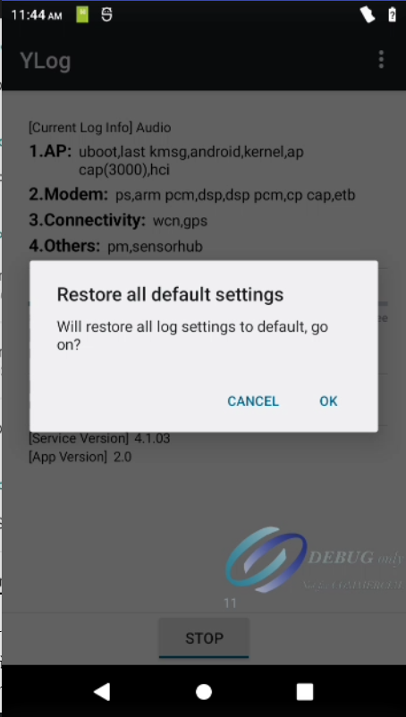

# 概要

展锐平台使用Ylog捉取问题log,不使用Hilogcat

# 打开Ylog

计算器输入!54321=

# 主界面介绍

# Ylog运行界面

# Ylog菜单介绍

点击Ylog主界面三个点,可以弹出菜单

* Custom

    Log类型是否需要捉取,可以按需配置是否捉取modem log,wifi log,modem log等类型,每个菜单还可以进入单独配置具体细分项,此处不在描述

    

* Template

    Log模板配置,对应问题类型,可以点击设置模板.例如捉取通话语音产生异常问题,可以点击Audio,设置模板.然后复现问题,捉取log.一般不用特殊配置.

    

* Setting

    配置ylog存储路径,log的size大小等内容.前提,要开启Ylog,才能进入设置

    

* Debug

   一些调试手段,例如捉取dump等,还有触发一些手动的assert,例如modem assert等

   

* Restore

    恢复Ylog的默认配置

    

* Clear

    清除之前捉取的log. 不论log开启与关闭,都可以点击该按钮清除log.对应有时候log太多,误导开发人员分析不相关的log.

    

* Help

    帮助菜单

    

# Ylog捉取

* 清除之前的log,点击Ylog菜单的Clear按钮

    

    

* 点击start按钮,开启Ylog,复现问题,停止Ylog

    

    

* 拉取Ylog

    * 首先查看Ylog存储路径,一般有3个路径,看设置的是存储在哪个路径

        * 如果选择的是外部存储,Ylog会保存在插入的sd卡根目录.

        * 如果选择的是内部存储,Ylog会保存在 /storage/emulated/0/ylog

            

        * 如果选择的是存储在Data分区, Ylog会保存在 /data/ylog

            

    * pull ylog

        看ylog保存在哪个目录,直接通过adb pull Ylog出来

        * adb pull /storage/emulated/0/ylog 20231002_1539_ylog_1

        * adb pull /data/ylog 20231002_1539_ylog_2

# Ylog内容

同事们可以打开对应log文件夹,看看是否有捉取到相应的log,才发给研发.不要发一个空log给研发

