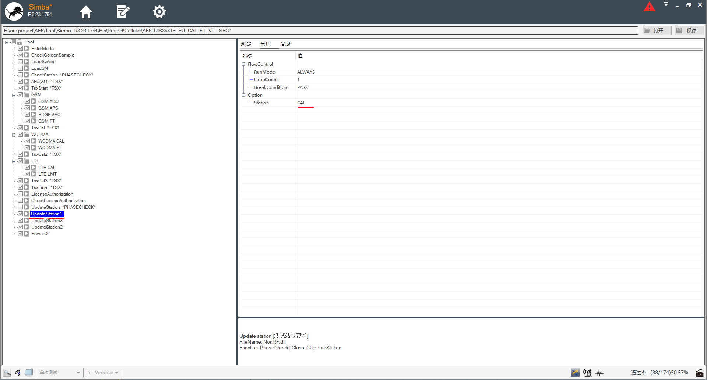
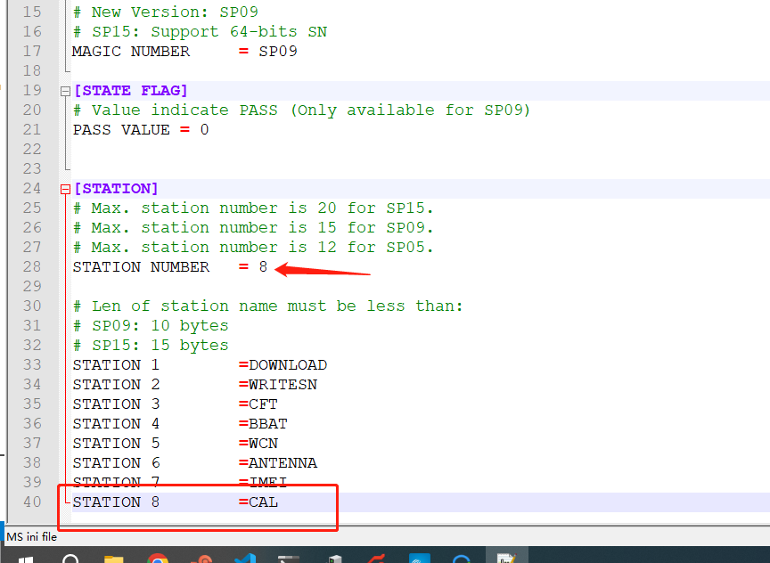

# 概要

一般项目都要显示校准,综测,耦合标志位,说一下展锐A12的校准标志位流程

# simba

使用simba工具,最后选择标志位,写入.如下图片,可以看到有UpdateStation1,UpdateStation2,UpdateStation3,三个选项

分别是对应写入, CAL,CFT,ANTENNA三个标志位,也就是校准,综测,耦合(天线)



# 展锐校准代码

* idh.code/vendor/sprd/proprietories-source/engpc/modules/libmiscdata/miscdata.c

可以看到里面有写入miscdata的值,其中PROP_MISCDATA_PATH的属性值是`/dev/block/by-name/`,所以拼接`miscdata`就是`/dev/block/by-name/miscdata`

```
int eng_write_miscdata(char *databuf, int data_len) {
  int ret = 0;
  int len;
  int fd = -1; 
  char prop[128] = {0};
  char miscdata_path[128] = {0};

  if (-1 == property_get(PROP_MISCDATA_PATH, prop, "")){
    ENG_LOG("%s: get partitionpath fail\n", __FUNCTION__);
    return -1; 
  }

  sprintf(miscdata_path, "%smiscdata", prop);
  fd = open(miscdata_path, O_WRONLY);
  if (fd >= 0) {
    ENG_LOG("%s open Ok miscdata_path = %s ", __FUNCTION__,
            miscdata_path);
#ifdef CONFIG_NAND
    __s64 up_sz = data_len;
    ioctl(fd, UBI_IOCVOLUP, &up_sz);
#endif
    len = write(fd, databuf, data_len);
        if (len <= 0) {
      ret = -2;
      ENG_LOG("%s read fail miscdata_path = %s ", __FUNCTION__,
              miscdata_path);
    }
    fsync(fd);
    close(fd);
  } else {
    ENG_LOG("%s open fail miscdata_path = %s ", __FUNCTION__,
            miscdata_path);
    ret = -3;
  }
  return ret;
}
```

# 开机读取标志位

在uboot阶段,添加了一个函数,开机读取标志位,传到cmdline,然后在init解析

* bsp/bootloader/u-boot15/pax/pax.c

`sprintf(command_line, "%s paxdroid.pass=0x%x", command_line, get_phase_check_sation_raw(0));`

```
int pax_command_line_handle(unsigned char *command_line, int inlen)
{
    char tbuf[4096];
    int ret;

    memset(command_line,0,inlen);

    memset(tbuf,0,sizeof(tbuf));
    ret = pax_get_sn(tbuf,sizeof(tbuf));
    if(ret!=0){
        tbuf[0]=0;
    }else{
        if(tbuf[0]==0xff)
            tbuf[0]=0;
    }
    tbuf[63]=0;
    sprintf(command_line, 
             "%s paxdroid.sn=%s", command_line, tbuf);

    memset(tbuf,0,sizeof(tbuf));
    ret = pax_get_exsn(tbuf,sizeof(tbuf));
    if(ret!=0){
        tbuf[0]=0;
    }else{
        if(tbuf[0]==0xff)
            tbuf[0]=0;
    }
    tbuf[63]=0;
    sprintf(command_line, 
             "%s paxdroid.exsn=%s", command_line, tbuf);

#if 1
    memset(tbuf,0,sizeof(tbuf));
    if(!misc_config_get("ethmac",tbuf)){
      sprintf(command_line, 
              "%s ethmac=%s", command_line, tbuf);
    }
            
    sprintf(command_line, 
                 "%s androidboot.poweronmode=%d", command_line, pax_porting_auto_power_on());
#endif

#if 0
    extern int logo_bmp_from_uboot;

    snprintf(command_line, len,
             "%s bmp_logo=%d", command_line, logo_bmp_from_uboot);
#endif

    sprintf(command_line, 
             "%s paxdroid.swrotation=%d", command_line, base_info_t->logo_rotation);

    sprintf(command_line, 
             "%s paxdroid.tested=0x%x", command_line, get_phase_check_sation_raw(1));

    sprintf(command_line, 
             "%s paxdroid.pass=0x%x", command_line, get_phase_check_sation_raw(0));

    sprintf(command_line,
             "%s androidboot.rotpk=%d", command_line, pax_porting_get_rotpk_enable());

    sprintf(command_line,
             "%s androidboot.paxproduct=%s", command_line, pax_get_product());

    sprintf(command_line,
             "%s androidboot.paxboard_id=%d", command_line, sprd_get_paxboard_id());

    memset(tbuf,0,sizeof(tbuf));
    pax_cfg_get("WIFI",tbuf,32);

    if(strcmp(tbuf,"20")==0){
      sprintf(command_line, 
               "%s androidboot.wifi=5g", command_line);
    }else if(strcmp(tbuf,"29")==0){
      sprintf(command_line, 
               "%s androidboot.wifi=5gu", command_line);
    }else{
      sprintf(command_line, 
               "%s androidboot.pax_usbhub=%s", command_line, base_info_t->usbhub);

      sprintf(command_line, 
               "%s androidboot.wifi=2g", command_line);
    }

    memset(tbuf,0,sizeof(tbuf));
	if(pax_cfg_get("LCD",tbuf,16) > 0){
		ret = simple_strtoul(tbuf, NULL, 10);
		sprintf(command_line, 
			 "%s paxdroid.lcd_value=%d", command_line,ret);
		
	}else if(lcd_id_get_lcd_soft_value() > 0){
		sprintf(command_line, 
			 "%s paxdroid.lcd_value=%d", command_line, lcd_id_get_lcd_soft_value());
	}
    memset(tbuf,0,sizeof(tbuf));
	if(pax_cfg_get("TOUCH_SCREEN",tbuf,16) > 0){
		ret = simple_strtoul(tbuf, NULL, 10);
		sprintf(command_line, 
			 "%s paxdroid.touch_value=%d", command_line,ret);
	}else if(lcd_id_get_tp_soft_value() > 0){
		sprintf(command_line, 
			 "%s paxdroid.touch_value=%d", command_line, lcd_id_get_tp_soft_value());
	}

    memset(tbuf,0,sizeof(tbuf));
	if(cfg_partition_get("LOCALE",tbuf, sizeof(tbuf)) > 0) {
      sprintf(command_line,
               "%s androidboot.locale=%s", command_line,tbuf);
    }

    memset(tbuf,0,sizeof(tbuf));
    pax_porting_get_sn(tbuf,sizeof(tbuf));
    sprintf(command_line, 
             "%s androidboot.cpu_uid=%s", command_line,tbuf);

#ifdef PAX_AUTH_DEBUG
    sprintf(command_line, 
             "%s paxdroid.aboot_version=%s-debug", command_line, ABOOT_VERSION);
#else
    sprintf(command_line, 
             "%s paxdroid.aboot_version=%s", command_line, ABOOT_VERSION);
#endif

    sprintf(command_line, 
             "%s paxdroid.aboot_git=%s", command_line, UBOOT_GIT_VERSION);

    memset(tbuf,0,sizeof(tbuf));
	if(permanent_config_get("TERMINAL_NAME", tbuf)>0)
		sprintf(command_line, 
             "%s paxdroid.TERMINAL_NAME=%s", command_line, tbuf);

	ret = uboot_is_wr_rpmb_key();
    sprintf(command_line, 
             "%s paxdroid.wr_rpmb_key=%s", command_line, ret>0?"1":"0");

    memset(tbuf,0,sizeof(tbuf));
    
    pax_cfg_get_base64(tbuf,sizeof(tbuf));
	if(authinfo.FirmDebugStatus)
		pax_cfg_get_base64_overlay(tbuf, sizeof(tbuf));
    sprintf(command_line, 
             "%s paxdroid.configfile=%s", command_line, tbuf);

    memset(tbuf,0,sizeof(tbuf));
    ret = base64encode(&authinfo,sizeof(authinfo),tbuf,sizeof(tbuf));
    tbuf[ret] = 0;
    sprintf(command_line, 
             "%s authinfo.content=%s", command_line, tbuf);
    return 0;
}
```

* idh.code/bsp/bootloader/u-boot15/common/loader/loader_common.c

在`fdt_fixup_all`的最后,拼接cmdline的`paxdroid.pass=0x7ffe`

在`get_phase_check_sation_raw`里面读取`PRODUCTINFO_FILE_PATITION`就是`miscdata`的值

```

void fdt_fixup_all(u8 *fdt_blob)
{
    ...
    char buftemp[4096]={0};
	pax_command_line_handle(buftemp,4096);
	fdt_chosen_bootargs_append(fdt_blob, buftemp, 1);
	
	return;
}
```

```
// testorpass 0-pass 1-tested
unsigned long get_phase_check_sation_raw(char testorpass){
	SP09_PHASE_CHECK_T phase_check_sp09;
	SP15_PHASE_CHECK_T phase_check_sp15;
	uint32_t magic;

	if (0 != common_raw_read(PRODUCTINFO_FILE_PATITION, sizeof(magic), (uint64_t)0, (char *)&magic)) {
		errorf("read miscdata error.\n");
		return 0xffffffff;
	}

	if(magic == SP09_SPPH_MAGIC_NUMBER){
      printf("SP09_SPPH_MAGIC_NUMBER\n");
		if(common_raw_read(PRODUCTINFO_FILE_PATITION,sizeof(phase_check_sp09), (uint64_t)0, (char *)&phase_check_sp09)){
            errorf("sp09 read miscdata error.\n");
            return 0xffffffff;
		}

        printf("phase_check_sp09 iTestSign 0x%x \n",phase_check_sp09.iTestSign);
        printf("phase_check_sp09 iItem 0x%x \n",phase_check_sp09.iItem);
        if(testorpass){
          return phase_check_sp09.iTestSign;
        }else{
          return phase_check_sp09.iItem;
        }
	}else if(magic == SP15_SPPH_MAGIC_NUMBER){
      printf("SP15_SPPH_MAGIC_NUMBER\n");
		if(common_raw_read(PRODUCTINFO_FILE_PATITION, sizeof(phase_check_sp15), (uint64_t)0 ,(char *)&phase_check_sp15)){
            errorf("sp15 read miscdata error.\n");
            return 0xffffffff;
		}

        printf("phase_check_sp15 iTestSign 0x%x \n",phase_check_sp15.iTestSign);
        printf("phase_check_sp15 iItem 0x%x \n",phase_check_sp15.iItem);

        if(testorpass){
          return phase_check_sp15.iTestSign;
        }else{
          return phase_check_sp15.iItem;
        }
	}

    return 0xffffffff;
}
```

* idh.code/bsp/bootloader/u-boot15/include/loader_common.h

所以看到,不管是sp15还是sp09,都是取`iItem`的值

```
#define PRODUCTINFO_FILE_PATITION  "miscdata"

typedef struct _tagSP09_PHASE_CHECK {
    uint32_t Magic; // "SP09"
    char SN1[SP09_MAX_SN_LEN];  // SN , SN_LEN=24
    char SN2[SP09_MAX_SN_LEN];  // add for Mobile
    int StationNum;     // the test station number of the testing
    char StationName[SP09_MAX_STATION_NUM][SP09_MAX_STATION_NAME_LEN];
    unsigned char Reserved[13]; //
    unsigned char SignFlag;
    char szLastFailDescription[SP09_MAX_LAST_DESCRIPTION_LEN];
    unsigned short iTestSign;   // Bit0~Bit14 ---> station0~station 14
    //if tested. 0: tested, 1: not tested
    unsigned short iItem;   // part1: Bit0~ Bit_14 indicate test Station,1 : Pass,

} SP09_PHASE_CHECK_T, *LPSP09_PHASE_CHECK_T;

typedef struct _tagSP15_PHASE_CHECK {
    uint32_t Magic; // "SP15"
    char SN1[SP15_MAX_SN_LEN];  // SN , SN_LEN=64
    char SN2[SP15_MAX_SN_LEN];  // add for Mobile
    int StationNum;     // the test station number of the testing
    char StationName[SP15_MAX_STATION_NUM][SP15_MAX_STATION_NAME_LEN];
    unsigned char Reserved[13]; //
    unsigned char SignFlag;
    char szLastFailDescription[SP15_MAX_LAST_DESCRIPTION_LEN];
    unsigned int iTestSign; // Bit0~Bit14 ---> station0~station 14
    //if tested. 0: tested, 1: not tested
    unsigned int iItem; // part1: Bit0~ Bit_14 indicate test Station,1 : Pass,

} SP15_PHASE_CHECK_T, *LPSP15_PHASE_CHECK_T;
```

* system/core/init/property_service.cpp

在解析cmdline里面的`import_pax_kernel_nv`函数,检测到`paxdroid.pass`值,赋予`ro.fac.ft.tested`

然后解析第三位`1<<2`的值如果是0,就代表有综测过`persist.radio.ft=1`

然后解析第六位`1<<5`的值如果是0,就代表有耦合过`persist.radio.coupling=1`

然后解析第八位`1<<7`的值如果是0,就代表有耦合过`persist.radio.cal=1`

```
void import_pax_kernel_nv(const std::string& key, const std::string& value) {
		if (StartsWith(key, "paxdroid.sn")) {
			InitPropertySet("ro.fac.sn", value.c_str());
			InitPropertySet("pax.sp.SN", value.c_str());
		} else if (StartsWith(key, "paxdroid.exsn")) {
			InitPropertySet("ro.fac.exsn", value.c_str());
		}else if (StartsWith(key, "paxdroid.swrotation")) {
		  InitPropertySet("ro.sf.swrotation", value.c_str());
		} else if (StartsWith(key, "paxdroid.TERMINAL_NAME")) {
		  InitPropertySet("ro.fac.permanent.TERMINAL_NAME", value.c_str());
		} else if (StartsWith(key, "paxdroid.wr_rpmb_key")) {
		  InitPropertySet("ro.fac.wr_rpmb_key", value.c_str());
  		}
		/*[FEATURE]-ADD-BEGIN by xiaolu@paxsz.com 2023-11-13, Added virtual lcd and tp support*/
		else if (StartsWith(key, "paxdroid.touch_value")) {
		  InitPropertySet("ro.fac.touch_value", value.c_str());
		} else if (StartsWith(key, "paxdroid.lcd_value")) {
		  InitPropertySet("ro.fac.lcd_value", value.c_str());
		} 
		/* [FEATURE]-ADD-END by xiaolu@paxsz.com 2023-11-13, Added virtual lcd and tp support*/
		else if (StartsWith(key, "paxdroid.tested")) {
		  InitPropertySet("ro.fac.ft.tested", value.c_str());
		} else if (StartsWith(key, "paxdroid.pass")) {
		  InitPropertySet("ro.fac.ft.pass", value.c_str());
		  unsigned long pass = strtoul(value.c_str(),NULL,16);
		  // unsigned long pass = strtoul("0xffffff52",NULL,16);
	
	
		  if(pass & (unsigned long)(1<<3)){ //BBAT
			InitPropertySet("persist.bbat.ft", "0");
		  }else{
			InitPropertySet("persist.bbat.ft", "1");
		  }
	
		  if(pass & (unsigned long)(1<<2)){ //CFT
			InitPropertySet("persist.radio.ft", "0");
		  }else{
			InitPropertySet("persist.radio.ft", "1");
		  }
	
		  if(pass & (unsigned long)(1<<5)){ //ANTENNA
			InitPropertySet("persist.radio.coupling", "0");
		  }else{
			InitPropertySet("persist.radio.coupling", "1");
		  }
	
		  if(pass & (unsigned long)(1<<4)){ //WCN
			InitPropertySet("persist.wcn.ft", "0");
		  }else{
			InitPropertySet("persist.wcn.ft", "1");
		  }
	
		  if(pass & (unsigned long)(1<<7)){ //CAL
			InitPropertySet("persist.radio.cal", "0");
		  }else{
			InitPropertySet("persist.radio.cal", "1");
		  }
	
		} else if (StartsWith(key, "paxdroid.aboot_version")){
			InitPropertySet("ro.fac.aboot_version", value.c_str());
		} else if (StartsWith(key, "paxdroid.aboot_git")){
			InitPropertySet("ro.fac.aboot_version_git", value.c_str()); 
		} else if (StartsWith(key, "paxdroid.configfile")){
			int len;
			unsigned char *str;
			unsigned char *val_str;
	
			len = value.size();
			str = (unsigned char *)malloc(len+1);
			val_str = (unsigned char *)malloc(len+1);
			if (str == NULL || NULL == val_str) {
				/* badly */
			}
			strcpy((char* __restrict)val_str,(const char *)value.c_str());
			
			len = base64decode((const unsigned char *)val_str, len, str, len);
			str[len] = 0;
			if (strncmp((const char *)(str+len-16), "SIGNED_VER:", (size_t)(sizeof("SIGNED_VER:")-1)) ==0) {
				/* remove signed data */
				*(str+len-284) = 0;
			}
			free(val_str);
			parse_config_file((const char *)str);
			free(str);
		} else if (StartsWith(key, "authinfo.content")) {
			int len;
			unsigned char *str;
			unsigned char *val_str;
	
			len = value.size();
			str = (unsigned char *)malloc(len+1);
			val_str = (unsigned char *)malloc(len+1);
			if (str == NULL || NULL == val_str) {
				/* badly */
			}
			strcpy((char* __restrict)val_str,(const char *)value.c_str());
			
			len = base64decode((const unsigned char *)val_str, len, str, len);
			
			POS_AUTH_INFO *auth = (POS_AUTH_INFO *)str;
			
			setAuthProp(auth);
			
			free(val_str);
			free(str);
		}
	}
```

# 问题

遇到使用simba工具,cal标志位写不进去, CFT,ANTENNA都可以写进去

原因,需要把`FactoryDownload_R25.21.1401\Bin\PhaseCheck.ini`添加一个`CAL`标志位

