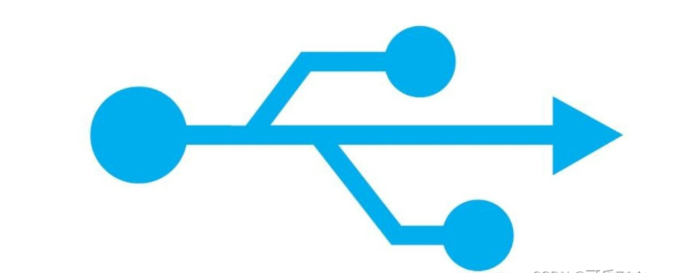
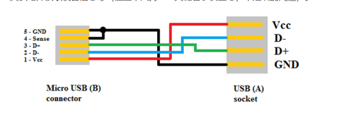

# temp

https://blog.csdn.net/whitefish520/article/details/106763476?ops_request_misc=%257B%2522request%255Fid%2522%253A%2522167403584916800192249817%2522%252C%2522scm%2522%253A%252220140713.130102334.pc%255Fblog.%2522%257D&request_id=167403584916800192249817&biz_id=0&utm_medium=distribute.pc_search_result.none-task-blog-2~blog~first_rank_ecpm_v1~rank_v31_ecpm-11-106763476-null-null.article_score_rank_blog&utm_term=USB&spm=1018.2226.3001.4450

# usb

* usb 图标

* usb接口名字

* type-c 接口线定义

* type-c 接口线定义2

* microusb接口线定义

* microusb otg线 内部原理图

    > 左边接口手机,手机检测  id脚拉到地, 切换成host模式
    > 手机id脚 默认拉高,做device模式
    > 电脑id脚也是拉低,host模式

# usb 是什么

Universal serial bus,通用串行总线

# usb解决什么问题

简化与外设的易用性,努力做到接口统一,并且支持热插拔

# usb otg

由于usb是主从模式,两个主机,两个从机无法通信.所以提出otg(on the go),允许设备在不同情况下主从切换

# usb 速度

## usb 1.0,usb 1.1

支持低速1.5Mbps,全速 12Mbps

## usb 2.0

高速模式,480Mbps,高速模式是可选的，不一定所有USB芯片都支持

## usb 3.0

5.0 Gbps

## usb 4.0

40Gbps,兼容雷电3,雷电4协议,并向后兼容 USB 3.2 和 USB 2.0

## usb 4.0 V2

80Gbps

# usb 拓扑结构

usb是主从模式,主机叫host,从机叫device.

一个主机有一个或者多个主控制器(host controller)和根集线器(root hub).

主控制器 负责数据处理,根集线器提供一个连接主控制器与device的接口与通路.

usb集线器(usb hub)可以对原有的usb口在数量上拓展,但不增加带宽,所以usb可以层层拓展,但 总数量有限.

# usb 电气特性

usb 2.0 4根线,vcc,D+,D1,gnd

otg 多一根线,id脚,用于判断主从

usb 2.0 三种传输速度,低速,1.5Mbps,全速12Mpbs,高速480Mbps

# usb 插入检测

主机端:D+,D- 15K电阻下拉到地,

从机端:D+,D-接1.5K 电阻上拉,具体接D+,D-,由速度决定

D+:全速,高速

D-:低速

当从机接入主机后,D-或者D+就会分压,主机检测到 D+,D- 电平变化,知道有设备插入

# usb描述符

usb主机如何知道usb设备的功能?

通过设备的描述符,描述符中,记录了设备的类型,厂商id等.

* 设备描述符(Device Discriptor)

    一个usb设备,只有一个设备描述符.设备描述符描述了该设备有多少配置,每种配置对应一个配置描述符.

    设备描述符主要描述信息,