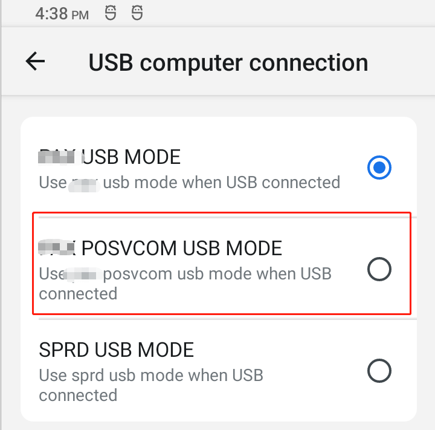

# 概要

usb 模拟tty dev,开机没有接收到usb connect状态

# 正常情况

正常选中下图标红的posvcom选项后,会`insmod tty_dev.ko`驱动,tty_dev驱动会注册 `usb_gadget_probe_driver(&usb_dev_driver);`

`usb_dev_driver`匹配的正确的usb后,会跑`tty_dev_setup`,这里不分析匹配过程

`tty_dev_setup`里面的 `USB_REQ_SET_CONFIGURATION`会调用`report_posvcom_status`,最终上报`/devices/virtual/ttydev/ttydev CONNECTED`

上层UsbDeviceManager会监听到`USB UEVENT`变化,弹出状态栏通知

`12-13 17:28:04.385   529  1109 V UsbDeviceManager: victor_usb,USB UEVENT: {SUBSYSTEM=ttydev, SEQNUM=3827, ACTION=change, USB_STATE=CONNECTED, DEVPATH=/devices/virtual/ttydev/ttydev}`



```
static struct usb_gadget_driver usb_dev_driver = {
#if LINUX_VERSION_CODE < KERNEL_VERSION(3,6,5)    
	.speed = USB_SPEED_FULL,
#else
    .max_speed = USB_SPEED_HIGH,
#endif	
	.function = (char *)"PAX_TTY_DEV_DRIVER",

	.bind = tty_dev_bind,

	.unbind = tty_dev_unbind,
	.setup = tty_dev_setup,
	.disconnect = tty_dev_disconnect,
	.suspend = tty_dev_suspend,
	.resume = tty_dev_resume,
#if (LINUX_VERSION_CODE >= KERNEL_VERSION(3,12,0))	
	.reset = tty_dev_reset,
#endif	
	.driver = {
		.name = "ttydev",
	},
};
```

```
int report_posvcom_status(struct device *dev, int status)
{
        char *disconnected[2] = { "USB_STATE=DISCONNECTED", NULL };
        char *connected[2]    = { "USB_STATE=CONNECTED", NULL };
        char *configured[2]   = { "USB_STATE=CONFIGURED", NULL };

        char **status_msg[] = {disconnected, connected, configured};

        if (likely(dev)) {
                kobject_uevent_env(&dev->kobj,
                        KOBJ_CHANGE, status_msg[status]);
        }else{
                printk(KERN_ERR "%s [LINE:%d] dev NULL \r\n",__func__,__LINE__);
        }

        return 0;
}
```

* frameworks/base/services/usb/java/com/android/server/usb/UsbDeviceManager.java

```
private static final String TTYDEV_STATE_MATCH ="DEVPATH=/devices/virtual/ttydev/ttydev";
// Watch for USB configuration changes
mUEventObserver = new UsbUEventObserver();
mUEventObserver.startObserving(USB_STATE_MATCH);
mUEventObserver.startObserving(ACCESSORY_START_MATCH);
mUEventObserver.startObserving(TTYDEV_STATE_MATCH);
private final class UsbUEventObserver extends UEventObserver {
        @Override
        public void onUEvent(UEventObserver.UEvent event) {
            if (DEBUG) Slog.v(TAG, "USB UEVENT: " + event.toString());

            String state = event.get("USB_STATE");
            String accessory = event.get("ACCESSORY");
            if (state != null) {
                mHandler.updateState(state);
            } else if ("GETPROTOCOL".equals(accessory)) {
                if (DEBUG) Slog.d(TAG, "got accessory get protocol");
                long elapsedRealtime = SystemClock.elapsedRealtime();
                mHandler.setAccessoryUEventTime(elapsedRealtime);
                resetAccessoryHandshakeTimeoutHandler();
            } else if ("SENDSTRING".equals(accessory)) {
                if (DEBUG) Slog.d(TAG, "got accessory send string");
                mHandler.sendEmptyMessage(MSG_INCREASE_SENDSTRING_COUNT);
                resetAccessoryHandshakeTimeoutHandler();
            } else if ("START".equals(accessory)) {
                if (DEBUG) Slog.d(TAG, "got accessory start");
                mHandler.removeMessages(MSG_ACCESSORY_HANDSHAKE_TIMEOUT);
                mHandler.setStartAccessoryTrue();
                startAccessoryMode();
            }
        }
    }
```

# 不弹出通知

打开tty的log可以看到, 插入usb,正常的启动,android很早就insmod tty的驱动了,所以内核大概10s的时候,就发了ttydev CONNECTED通知.

所以java层还没注册监听,导致一直错误接受connected信息

```
tty_dev_setup go in,line=1386,USB_REQ_SET_CONFIGURATION schedule_delayed_work begin,
12-13 15:44:30.832   663   734 D ENGPC:  :  [tid:0]parse_event: event { 'change', '/devices/virtual/ttydev/ttydev', 'ttydev', 'CONNECTED' }
```

# 解决方法

延时35s发送

```
if(first_connect_tty == 0){
 			first_connect_tty = 1;
 			schedule_delayed_work(&tdev->work, msecs_to_jiffies(35000));
 		}else{
 			schedule_delayed_work(&tdev->work, 0);
 		}
```