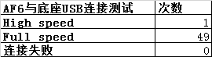

# 概要

有些项目需要连接usb外设,有时候会有问题,适配不到high speed模式,只能适配full speed模式

这时候就需要从log判断插入的是哪一种模式

# dmesg

一般dmesg | grep usb -i --color就能过滤出来 是full speed 还是high speed

还会打印一些 插入设备的一些信息,例如pid vid,product名字等

普通uart可能log等级不够,打印不出来

`new full-speed USB device number 2 using musb-hdrc`

```
[   25.120162] c0usb 1-1: new full-speed USB device number 2 using musb-hdrc
[   25.268970] c0usb 1-1: not running at top speed; connect to a high speed hub
[   25.269378] c0usb 1-1: config 0 contains an unexpected descriptor of type 0x2, skipping
[   25.269393] c0usb 1-1: Duplicate descriptor for config 0 interface 0 altsetting 0, skipping
[   25.269397] c0usb 1-1: Duplicate descriptor for config 0 interface 1 altsetting 0, skipping
[   25.269401] c0usb 1-1: Duplicate descriptor for config 0 interface 1 altsetting 1, skipping
[   25.269767] c0usb 1-1: New USB device found, idVendor=1a86, idProduct=fe23, bcdDevice= 0.01
[   25.269774] c0usb 1-1: New USB device strings: Mfr=1, Product=2, SerialNumber=3
[   25.269779] c0usb 1-1: Product: CH32V30x
[   25.269783] c0usb 1-1: Manufacturer: wch.cn
[   25.269786] c0usb 1-1: SerialNumber: 0123456789
[   25.270378] c0usb 1-1: config 0 descriptor??
[   25.272806] c0cdc_ether 1-1:0.0 eth0: register 'cdc_ether' at usb-musb-hdrc.1.auto-1, CDC Ethernet Device, 54:14:a7:42:e3:25
[   33.737031] c6init: processing action (pax.ctrl.usb.plug=out && sys.usb.mode=pax) from (/init.paxdroid.rc:190)
[   38.704145] c3type=1400 audit(1703757640.079:313): avc: denied { search } for comm="DecodeHandler" name="android_usb" dev="sysfs" ino=21393 scontext=u:r:system_app:s0 tcontext=u:object_r:sysfs_android_usb:s0 tclass=dir permissive=0
[   39.320278] c0WCN SDIO: : usbhub_download_firmware start download firmware!
[   39.320883] c0WCN SDIO: : usbhub_download_firmware successfully through request_firmware!
[   39.320887] c0WCN SDIO: : usbhub_download_firmware successfully through request_firmware!
console:/ # lsusb
Bus 001 Device 001: ID 1d6b:0002
Bus 001 Device 002: ID 1a86:fe23
```

# 方法

* 插入串口,输入echo 0 > proc/sys/kernel/printk, 禁止串口输出

* 然后,输入dmesg 过滤 usb log

# 测试数据

