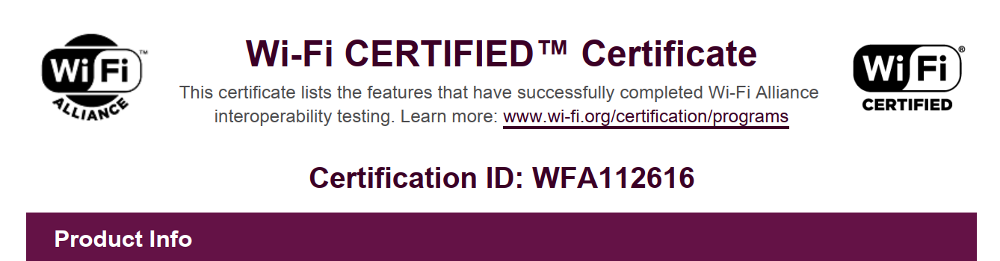
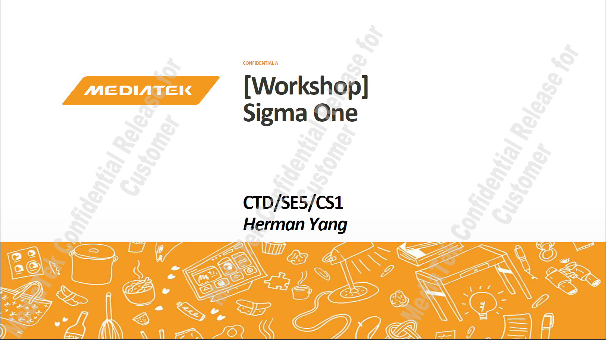
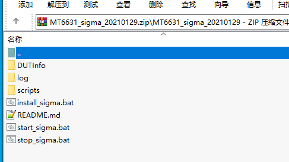

# README

wifi 联盟认证的知识点

# WFA

# 提供工具给实验室

## MTK平台

* Android_Q_workshop_Sigma_One.pdf

* MT6631_sigma_20210129.zip

## 高通平台

* 内置工具 ls -l vendor/bin/sigma_dut

* [sigma_dut通常软件包都有](https://github.com/qca/sigma-dut)